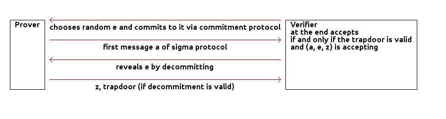

# A quick review of the theory behind Emmy

## What is a zero-knowlede proof (ZKP)?
A zero-knowledge proof is protocol by which one party (prover) proves to another party (verifier) that a given statement is true, without conveying any information apart from the fact that the statement is indeed true.

The required properties for zero knowledge proofs are:

 * _completeness_ - if the statement is true, the honest verifier (the verifier that follows the protocol properly) will be convinced of this fact with overwhelming probability,
 * _soundness_ - no one who does not know the secret can convince the verifier with non-negligible probability,
 * _zero knowledge_ - the proof does not leak any information.
 
A good resource on zero-knowledge proofs is [1].

## How can we build zero-knowledge proofs?
Zero-knowledge proofs can be built upon **sigma protocols**. Sigma protocols are three-move protocols (commitment, challenge and response) which have the following properties: _completeness_, _special soundness_, and _special honest zero knowledge verifier_ (not going into definitions here, please refer to [1]). An example of a 
sigma protocol is Schnorr protocol, where the prover proves that he knows *w* such that *g^w = h mod p* (proof of knowledge of a discrete logarithm):

In the first step of the sigma protocol, a pair of messages for proving the knowledge of random data (e.g. based on a large random number) is exchanged. In the second step of the protocol, the prover and the verifier exchange a pair of messages proving the knowledge of the actual data.

We can turn sigma protocols like Schnorr protocol into **zero-knowledge proofs (ZKP)** or **zero-knowledge proof of knowledge (ZKPOK)**. The key is to enforce the verifier to behave honestly. This can be achieved using **commitment schemes**, where the verifier commits to a challenge and reveals the commited value when sending the challenge to the prover, for instance, like depicted below:

We can see that the prover asks for a commitment to a challenge (therefore an additional message exchanged is at the beginning). We now have a zero-knowledge proof. Furthermore, if the prover sends a trapdoor to the verifier in the last message of the protocol, and the verifier is able to validate it, then we have zero-knowledge proof of knowledge.

## References

[1] C. Hazay and Y. Lindell. Efficient Secure Two-Party Computation: Techniques and Constructions. Springer, 2010.